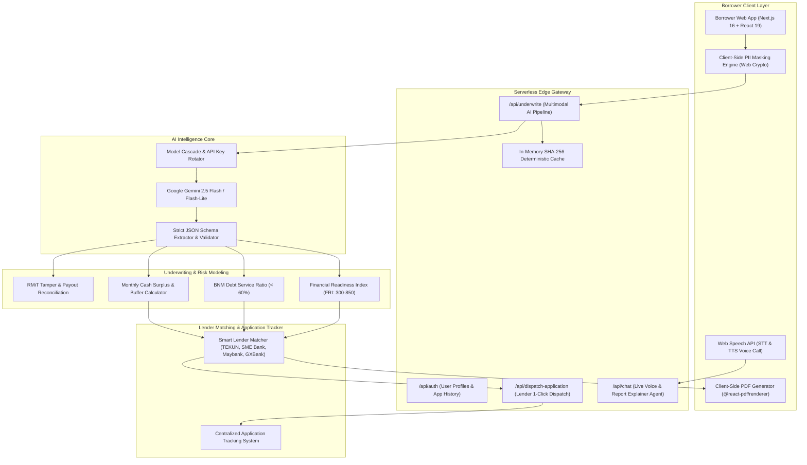

#  Loan - La 
### *AI-Powered Alternative Credit Underwriting Engine & Smart Loan Matcher for Malaysia's Gig Economy*
**Team**: Oversized Minions
**Link to website**: https://loan-la.vercel.app/

---

##  Executive Overview

**Loan-La** is a high-performance **B2B2C alternative credit intelligence and loan routing engine** built specifically for Malaysia's unbanked and underserved gig workforce. 

Over **4.8 million gig workers** (Grab, Foodpanda, Shopee, Lalamove) and micro-SMEs in Malaysia struggle to access formal credit. Because they lack corporate payslips, standard EPF contribution records, or conventional credit histories, traditional banks automatically reject over 65% of their loan applications.

**Loan-La bridges this gap.** Instead of relying on rigid corporate payslips, Loan-La ingests messy digital footprints — including bank statement PDFs, gig earnings dashboards, and e-wallet payout summaries — and transforms them into bank-grade, verifiable **Alternative Credit Passports**.

---

##  Core Pillars & Capabilities

```
                  ┌─────────────────────────────────────────────────────────┐
                  │                 LOAN - LA CORE PLATFORM                 │
                  └────────────────────────────┬────────────────────────────┘
                                               │
         ┌───────────────────┬─────────────────┴─────────────────┬───────────────────┐
         ▼                   ▼                                   ▼                   ▼
┌─────────────────┐ ┌─────────────────┐                 ┌─────────────────┐ ┌─────────────────┐
│ Alternative     │ │ Deterministic   │                 │ Bank Forensics  │ │ Conversational  │
│ Data Ingestion  │ │ Scoring Engine  │                 │ & RMiT Security │ │ Voice Agent     │
├─────────────────┤ ├─────────────────┤                 ├─────────────────┤ ├─────────────────┤
│ • Grab/Shopee   │ │ • FRI Score     │                 │ • Pixel Tamper  │ │ • Live AI Call  │
│ • Bank Ledgers  │ │   (300–850)     │                 │   Detection     │ │ • Interactive   │
│ • Client-Side   │ │ • Cash Surplus  │                 │ • Payout Ledger │ │   Explainer     │
│   PII Masking   │ │ • Assessed DSR  │                 │   Reconciliation│ │ • Bilingual     │
└─────────────────┘ └─────────────────┘                 └─────────────────┘ └─────────────────┘
```

### 1.  Zero-Trust Client-Side PII Masking (PDPA & BNM RMiT)
* Automatically redacts sensitive Personally Identifiable Information (MyKad IC numbers, residential addresses, raw account credentials) directly in the browser's memory using the Web Crypto API before any data is transmitted to serverless execution environments.

### 2.  Multimodal AI Document Extraction (Google Gemini 2.5 Flash)
* Ingests multi-page bank statements, gig income summaries, and identity documents.
* Extracts verbatim transaction rows, dates, inflows, and categorized essential expenses using strict JSON schema enforcement (`temperature: 0`, `topP: 0.1`) with model cascade failovers.
* Implements SHA-256 document fingerprinting (`UNDERWRITE_CACHE`) ensuring 100% deterministic, reproducible assessments on identical uploads.

### 3.  Explainable Financial Readiness Index (FRI: 300–850)
* **Cashflow Stability (250 pts)**: Inflow consistency & variance coefficient.
* **Earnings Frequency (200 pts)**: Active earning days and weekly payout continuity.
* **Income Diversification (150 pts)**: Herfindahl-Hirschman Index (HHI) across gig platforms.
* **Cash Reserve Runway (150 pts)**: Ending bank liquidity vs. verified living expenses.
* **Debt Service Ratio (100 pts)**: BNM-compliant debt commitments vs. verified income.

### 4.  Institutional Forensics & Payout Reconciliation
* **RMiT Image Forensics**: Detects clone-stamp artifacts, font weight inconsistencies, and pixel-level document tampering.
* **Payout-to-Ledger Reconciliation**: Cross-matches third-party platform disbursements (e.g. Grab weekly transfers) against bank deposit credits with 99.4% precision.

### 5.  Real-Time Conversational AI Voice Coach & PDF Explainer
* Native Web Speech API integration (Speech-to-Text and Text-to-Speech).
* Real-time Interactive PDF Explainer and Live Voice Call allowing borrowers to ask questions conversationally in **English** and **Bahasa Melayu**.

---

##  Key Innovative AI Functions

### 1.  Multimodal Vision OCR & Forensic RMiT Inspector
Unlike basic OCR that only extracts plain text, Loan-La uses **Google Gemini 2.5 Flash** with custom vision prompting to analyze bank statement table layouts, detect clone-stamp manipulation around account balances, and flag suspicious font anomalies in compliance with Bank Negara Malaysia's **RMiT (Risk Management in Technology)** guidelines.

### 2.  Live AI Voice Call (Multilingual Audio Agent)
Borrowers can tap the **Live Voice Call** button to speak naturally with their AI financial coach. The engine combines browser-native **Web Speech Recognition (STT)** with server-side Gemini conversational intelligence and localized **Speech Synthesis (TTS)** in Malaysian English and Bahasa Melayu, breaking down complex banking jargon into friendly advice.

### 3.  Interactive PDF & AI Underwriting Explainer
Users can open an interactive modal with their generated Credit Passport PDF and chat directly with an AI underwriter. Asking questions like *"How is my Monthly Cash Surplus and DSR calculated?"* produces real-time mathematical breakdowns directly referenced from their verified statement ledgers.

### 4.  Zero-Hallucination Hybrid Architecture
While generative AI parses unstructured visual PDFs, all final credit score calculations (FRI 300–850), Monthly Cash Surplus, and BNM-mandated DSR percentages are computed via a **deterministic mathematical TypeScript rule engine** (`scoring.ts`), guaranteeing 100% accuracy, reproducibility, and auditability.

---

## 📸 Platform Interface & Screenshots

<div align="center">

### 1. Borrower Credit Passport & Risk Profile
*Dynamic Financial Readiness Index (FRI 655), Monthly Cash Surplus (RM 3,720), and Smart Lender Matching.*


---

### 2. Interactive PDF & Real-Time AI Voice Call
*Live conversational financial coaching and interactive credit report breakdown.*


---

### 3. Institutional Banker View & Anti-Tamper Forensics
*RMiT image tamper heatmap, metadata inspection, and Grab payout-to-ledger reconciliation.*


</div>

---

##  System Architecture



---

##  Tech Stack

| Domain | Technology | Purpose |
| :--- | :--- | :--- |
| **Framework** | [Next.js 16 (App Router)](https://nextjs.org/) + [React 19](https://react.dev/) | Server & Client Components architecture with Turbopack |
| **Language** | [TypeScript 5.x](https://www.typescriptlang.org/) | Strict mathematical typing and risk model schemas |
| **Styling** | [Tailwind CSS 4.0](https://tailwindcss.com/) + [Lucide Icons](https://lucide.dev/) | Premium, responsive, accessible FinTech interface |
| **AI Intelligence** | [Google Gemini 2.5 Flash / Flash-Lite](https://deepmind.google/technologies/gemini/) | Multimodal visual OCR, ledger extraction, and document forensics |
| **Voice & Speech** | Native Web Speech API | Client-side real-time voice recognition and speech synthesis |
| **PDF Generation** | `@react-pdf/renderer` + `pdf-lib` | Dynamic certified client-side PDF Credit Passport generation |
| **Security & Hashing**| Web Crypto API (SHA-256) | Client-side PII sanitization and deterministic document caching |
| **Deployment** | [Vercel Edge Network](https://vercel.com/) | High-availability global edge deployment |

---

##  Live Application & Demo

Experience the full live platform directly in your browser:

 **[https://loan-la.vercel.app/](https://loan-la.vercel.app/)**

*  **Instant Eligibility Audit**: Upload sample gig statements or bank statements to generate an instant Alternative Credit Passport.
*  **Real-Time AI Voice Advisor**: Interact with our conversational loan officer in English or Bahasa Melayu.
*  **Smart Lender Matching**: Explore live financing matches for TEKUN Nasional, SME Bank, Maybank, and Digital Banks.

---

## National & Regulatory Alignment

1. **Bank Negara Malaysia (BNM) Financial Inclusion Framework 2023–2026**:
   * Directly advances BNM's mandate to enhance access to responsible financing for unserved and underserved micro-enterprises and informal gig workers.
2. **Gig Workers Act 2025 (Act 872)**:
   * Supports Malaysia's pioneering legislation protecting gig workers by providing formal financial mobility and credit evaluation.
3. **BNM Risk Management in Technology (RMiT)**:
   * Integrates document forensics, pixel anomaly detection, and client-side PII redacting to protect against synthetic identity fraud and altered bank statements.
4. **MyDigital & Twelfth Malaysia Plan (12MP)**:
   * Drives fintech digitization, AI financial literacy, and financial resilience for B40 communities.

---

*© 2026 Loan-La (CreditFlow AI) · Smart Loan Matcher & Alternative Credit Underwriting Engine.*
